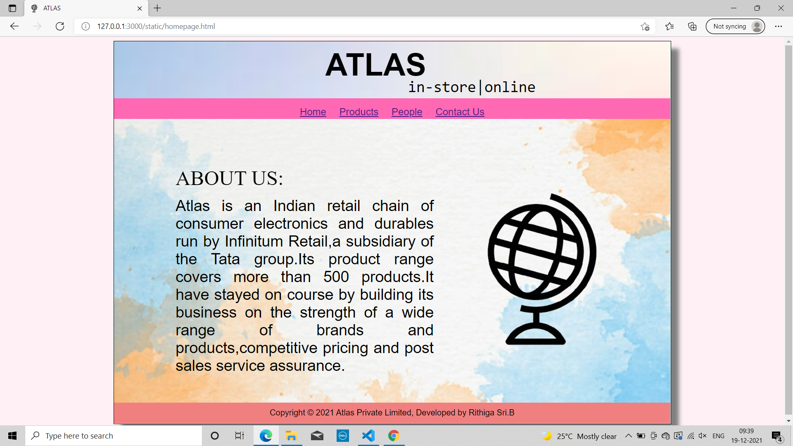
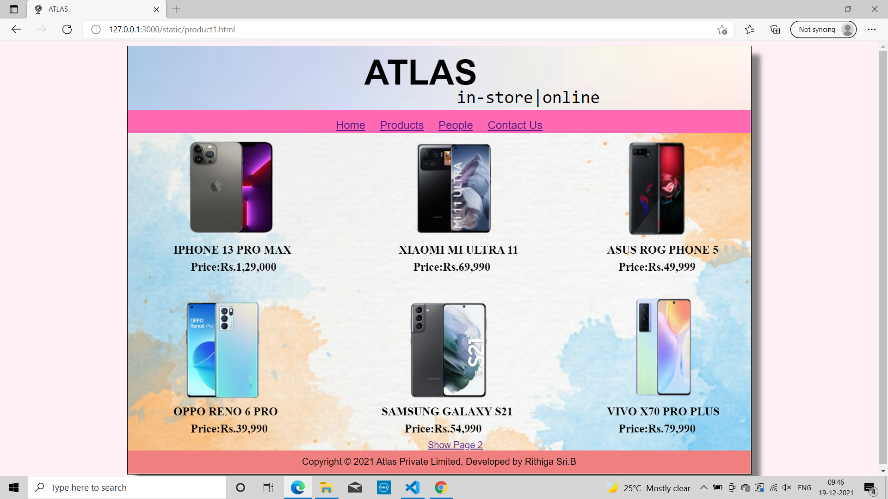
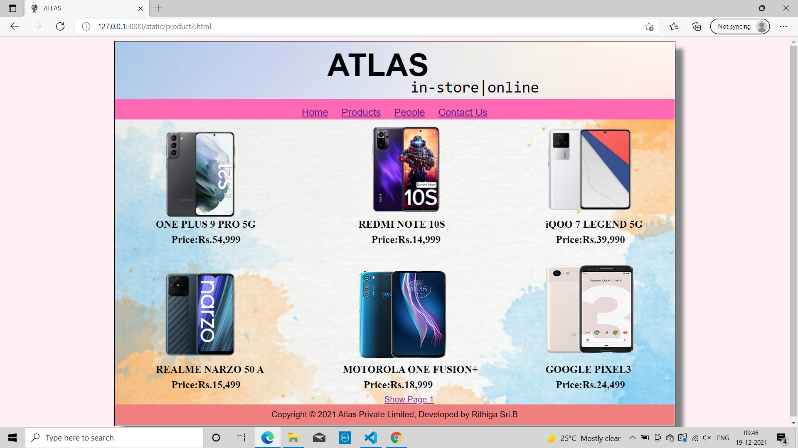
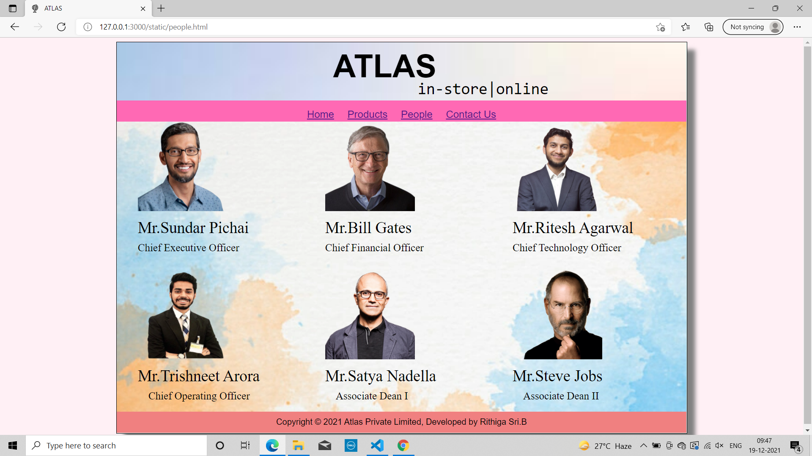
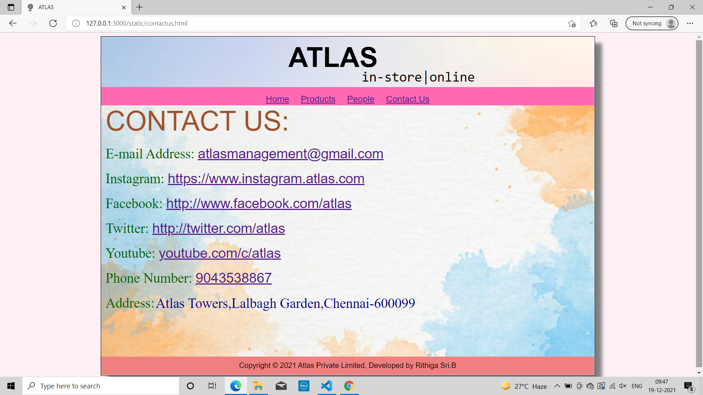
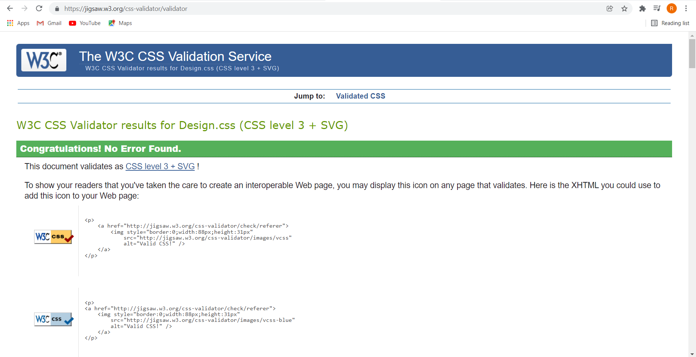
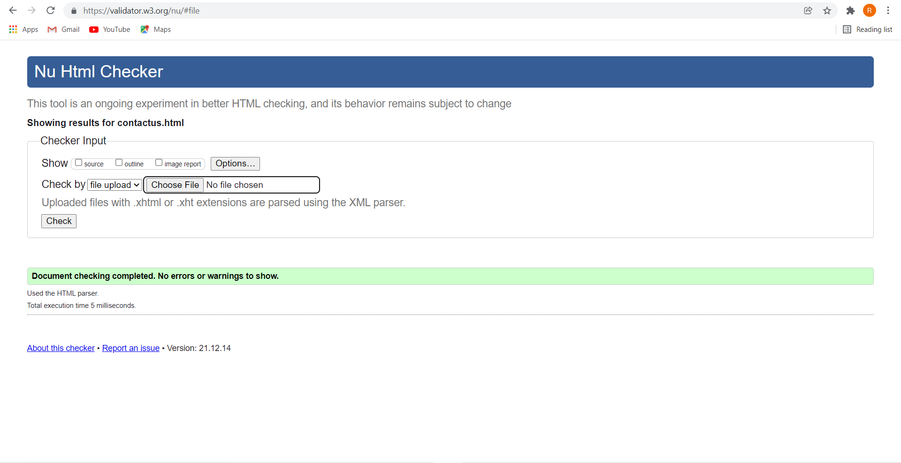

# Web Design for a Software Product Company

## AIM:

To design a static website for a software product company company.

## DESIGN STEPS:

### Step 1:

Requirement collection.

### Step 2:

Creating the layout using HTML and CSS.

### Step 3:

Updating the sample content.

### Step 4:

Choose the appropriate style and color scheme.

### Step 5:

Validate the layout in various browsers.

### Step 6:

Validate the HTML code.

### Step 7:

Publish the website in the given URL.

## PROGRAM :
### Homepage HTML Coding:
```
<!DOCTYPE html>
<html lang="en">
    <head>
        <title>ATLAS</title>
        <link rel="stylesheet" href="./css/Design.css"/>
        <link rel="icon" href="img/logo.png" type="image/x-icon">
    
    </head>
    <body>
        <div class="container">
            <div class="topimg">
                <div class="heading">ATLAS</div>
                
                <div class="quote">in-store|online</div>
            </div>
            <div class="menu">
                <div class="menuitem"><a href="homepage.html">Home</a> </div>
                <div class="menuitem"><a href="product1.html">Products</a> </div>
                <div class="menuitem"><a href="people.html">People</a> </div>                
                <div class="menuitem"><a href="contactus.html">Contact Us</a> </div>
                    
            </div> 
            
            <div class="bgabout">
                
                <div class="head">ABOUT US:</div>
                <div class="aboutusimg">
                
                </div>
                   
                <div class="aboutus">
                    
                    Atlas is an Indian retail chain of consumer electronics and durables
                    run by Infinitum Retail,a subsidiary of the Tata group.Its product range covers more than
                    500 products.It have stayed on course by building its business on the strength of
                    a wide range of brands and products,competitive pricing and post sales service assurance.
                

                </div>
                </div>
        <div class="footer">Copyright &#169; 2021 Atlas Private Limited, Developed by Rithiga Sri.B</div>


        </div>


    </body>
    
    


</html>
```
### Product Page1 HTML Coding:
```
<!DOCTYPE html>
<html lang="en">
    <head>
        <title>ATLAS</title>
        <link rel="stylesheet" href="./css/Design.css"/>
        <link rel="icon" href="img/logo.png" type="image/x-icon"/>       
    </head>

    <body>
        <div class="container">
            <div class="topimg">
                <div class="heading">ATLAS</div>
                
                <div class="quote">in-store|online</div>
            </div>
            <div class="menu">
                <div class="menuitem"><a href="homepage.html">Home</a> </div>
                <div class="menuitem"><a href="product1.html">Products</a> </div>
                <div class="menuitem"><a href="people.html">People</a> </div>                
                <div class="menuitem"><a href="contactus.html">Contact Us</a> </div>
                    
            </div>   
            <div class="bgabout">
            
                <div class="productcontent">
                <div id="Page1">
                    <div class="productimg1">
                    
                    </div>
                    <div class="productname1">IPHONE 13 PRO MAX</div>
                    <div class="productprice1">Price:Rs.1,29,000</div>
                    <div class="productimg2">
                    
                    </div>
                    <div class="productname2">XIAOMI MI ULTRA 11</div>
                    <div class="productprice2">Price:Rs.69,990</div>
                    <div class="productimg3">
                    
                    </div>
                    <div class="productname3">ASUS ROG PHONE 5</div>
                    <div class="productprice3">Price:Rs.49,999</div>
                    <div class="productimg4">
                    
                    </div>
                    <div class="productname4">OPPO RENO 6 PRO</div>
                    <div class="productprice4">Price:Rs.39,990</div>
                    <div class="productimg5">
                    
                    </div>
                    <div class="productname5">SAMSUNG GALAXY S21</div>
                    <div class="productprice5">Price:Rs.54,990</div>
                    <div class="productimg6">
                    
                    </div>
                    <div class="productname6">VIVO X70 PRO PLUS</div>
                    <div class="productprice6">Price:Rs.79,990</div>

        
            
                <a href="product2.html" onclick="return show('Page2','Page1');">Show Page 2</a>
                </div>
                </div>
            </div>
                
        
       

        <div class="footer">Copyright &#169; 2021 Atlas Private Limited, Developed by Rithiga Sri.B</div>
        </div>
    </body>
</html>
```
### Product Page2 HTML Coding:
```
<!DOCTYPE html>
<html lang="en">
    <head>
        <title>ATLAS</title>
        <link rel="stylesheet" href="css/Design.css">
        <link rel="icon" href="img/logo.png" type="image/x-icon"/>       
    </head>

    <body>
        <div class="container">
            <div class="topimg">
                <div class="heading">ATLAS</div>
                
                <div class="quote">in-store|online</div>
            </div>
            <div class="menu">
                <div class="menuitem"><a href="homepage.html">Home</a> </div>
                <div class="menuitem"><a href="product1.html">Products</a> </div>
                <div class="menuitem"><a href="people.html">People</a> </div>
                <div class="menuitem"><a href="contactus.html">Contact Us</a> </div>
                
            </div>    
            <div class="bgabout">

                <div class="productcontent">
                <div id="Page2">
                    <div class="product2img1">
                    
                    </div>
                    <div class="productname1">ONE PLUS 9 PRO 5G</div>
                    <div class="productprice1">Price:Rs.54,999</div>
                    <div class="productimg2">
                    
                    </div>
                    <div class="productname2">REDMI NOTE 10S</div>
                    <div class="productprice2">Price:Rs.14,999</div>
                    <div class="productimg3">
                    
                    </div>
                    <div class="productname3">iQOO 7 LEGEND 5G</div>
                    <div class="productprice3">Price:Rs.39,990</div>
                    <div class="productimg4">
                    
                    </div>
                    <div class="productname4">REALME NARZO 50 A</div>
                    <div class="productprice4">Price:Rs.15,499</div>
                    <div class="productimg5">
                    
                    </div>
                    <div class="productname5">MOTOROLA ONE FUSION+</div>
                    <div class="productprice5">Price:Rs.18,999</div>
                    <div class="productimg6">
                    
                    </div>
                    <div class="productname6">GOOGLE PIXEL3</div>
                    <div class="productprice6">Price:Rs.24,499</div>                  
                    <a href="product1.html" onclick="return show('Page1','Page2');">Show Page 1</a>
                </div>
                </div>
            </div>


            <div class="footer">Copyright &#169; 2021 Atlas Private Limited, Developed by Rithiga Sri.B</div>
        </div>
                
    
    
    </body>
</html>
```

### People Page HTML Coding:
```
<!DOCTYPE html>
<html lang="en">
    <head>
        <title>ATLAS</title>
        <link rel="stylesheet" href="./css/Design.css"/>
        <link rel="icon" href="img/logo.png" type="image/x-icon"/>       
    </head>

    <body>
        <div class="container">
            <div class="topimg">
                <div class="heading">ATLAS</div>
                
                <div class="quote">in-store|online</div>
            </div>
            <div class="menu">
                <div class="menuitem"><a href="homepage.html">Home</a> </div>
                <div class="menuitem"><a href="product1.html">Products</a> </div>
                <div class="menuitem"><a href="people.html">People</a> </div>
                <div class="menuitem"><a href="contactus.html">Contact Us</a> </div>
                
            </div>  
            <div class="bgabout">
            
                <div class="productcontent">
                    
                        <div class="img">
                        
                        </div>
                        <div class="img">
                        
                        </div>
                        <div class="img">
                        
                        </div>
                        
                        <div class="name1">Mr.Sundar Pichai</div>
                        <div class="name1">Mr.Bill Gates</div>
                        <div class="name1">Mr.Ritesh Agarwal</div>
                        
                        <div class="title1">Chief Executive Officer</div>
                        <div class="title1">Chief Financial Officer</div>
                        <div class="title1">Chief Technology Officer</div>
                        <div class="img2">
                        
                        </div>
                        <div class="img2">
                        
                        </div>
                        <div class="img2">
                        
                        </div>
                        <div class="name2">Mr.Trishneet Arora</div>
                        <div class="name2">Mr.Satya Nadella</div>
                        <div class="name2">Mr.Steve Jobs</div>
                        <div class="title2">Chief Operating Officer</div>
                        <div class="title2">Associate Dean I</div>
                        <div class="title2">Associate Dean II</div>


                    
                </div>
            </div>
            
        <div class="footer">Copyright &#169; 2021 Atlas Private Limited, Developed by Rithiga Sri.B</div>
        </div>
    </body>
</html>
```
### Contact Us Page HTML Coding:
```
<!DOCTYPE html>
<html lang="en">
    <head>
    <meta charset="utf-8"/>
        <title>ATLAS</title>
        <link rel="stylesheet" href="./css/Design.css"/>
        <link rel="icon" href="img/logo.png" type="image/x-icon"/>       
    </head>

    <body>
        <div class="container">
            <div class="topimg">
                <div class="heading">ATLAS</div>
                
                <div class="quote">in-store|online</div>
            </div> 
            <div class="menu">
                <div class="menuitem"><a href="homepage.html">Home</a> </div>
                <div class="menuitem"><a href="product1.html">Products</a> </div>
                <div class="menuitem"><a href="people.html">People</a> </div>
                <div class="menuitem"><a href="contactus.html">Contact Us</a> </div>
                
            </div>   
            <div class="bgabout">
                <div class="productcontent">
                    <div class="contact">CONTACT US:</div>
                    <div class="address">E-mail Address: <a href="#">atlasmanagement@gmail.com</a></div>
                    <div class="address">Instagram: <a href="#">https://www.instagram.atlas.com</a></div>
                    <div class="address">Facebook: <a href="#">http://www.facebook.com/atlas</a></div>
                    <div class="address">Twitter: <a href="#">http://twitter.com/atlas</a></div>
                    <div class="address">Youtube: <a href="#">youtube.com/c/atlas</a></div>
                    <div class="address">Phone Number: <a href="#">9043538867</a></div>
                    <div class="address">Address: </div>
                    <div class="contactaddress">Atlas Towers,Lalbagh Garden,Chennai-600099</div>
               
                </div>
            </div>
        <div class="footer">Copyright &#169; 2021 Atlas Private Limited, Developed by Rithiga Sri.B</div>
        </div>
    </body>
</html>
```
### CSS Coding:
```
* {
    box-sizing: border-box;
    font-family: Arial, Helvetica, sans-serif;
}

body{
    background-color: lavenderblush;
    color:black;
    
}
.container{
    width: 1080px;
    margin-left: auto;
    margin-right: auto;
    border-width: 1px 1px 1px 1px;
    border-style: solid;
    box-shadow: 15px 15px 8px gray;
    background-color: lightcyan;
}

.topimg {
    width:100%;
    height:110px;
    background-image: url("https://encrypted-tbn0.gstatic.com/images?q=tbn:ANd9GcQmVM7BG0nyXw49n34MkyOGo1NGvDvC4fw8xQ&usqp=CAU");
    background-size:cover;
    background-color: lavender;
}

.heading{
    display:block;
    position:absolute;
    top:20px;
    left:630px;
    text-align: center;
    font-size: 60px;
    font-weight:bolder;
    color:black;
}

.quote{
    display:block;
    position:absolute;
    left:790px;
    top:80px;
    font-size:30px;
    color:black;
    font-family: monospace;
}

.bgabout{
   
    background-image: url("https://img.freepik.com/free-photo/hand-painted-watercolor-background-with-sky-clouds-shape_24972-1095.jpg?size=626&ext=jpg");
    width:100%;
    height:550px;
    background-size:cover;

}
.head{
    font-size:40px;
    color:black;
    display:block;
    position:absolute;
    top:250px;
    left:340px;
    font-family:serif;
}

.aboutus{
    font-size: 30px;
    color:black;
    display: inline-block;
    width:500px;
    position: absolute;
    top:310px;
    left:340px;
    right:350px;
    text-align:justify;
}
.aboutusimg{
    position: absolute;
    top:300px;
    left:900px;
}
.footer{
    display:block;
    width:100%;
    height: 40px;
    background-color:lightcoral;
    color:black;
    text-align: center;
    padding-top: 10px;
    margin: 0px 0px 0px 0px;

    
}
.productcontent{
    margin-left: 10px;
    
}

.productimg1{
    position:fixed;
    left:300px;
    top:150px;
}
.productname1{
    font-family: 'Times New Roman', Times, serif;
    font-size: 20px;
    position: fixed;
    left:300px;
    top:350px;
    font-weight: bold;
}
.productprice1{
    font-family: 'Times New Roman', Times, serif;
    font-size: 20px;
    position: fixed;
    left:330px;
    top:380px;
    font-weight: bold;
    

}
.productimg2{
    position:fixed;
    left:690px;
    top:160px;
}
.productname2{
    font-family: 'Times New Roman', Times, serif;
    font-size: 20px;
    position: fixed;
    left:690px;
    top:350px;
    font-weight: bold;
}
.productprice2{
    font-family: 'Times New Roman', Times, serif;
    font-size: 20px;
    position: fixed;
    left:715px;
    top:380px;
    font-weight: bold;
}

.productimg3{
    position:fixed;
    left:1050px;
    top:170px;
}
.productname3{
    font-family: 'Times New Roman', Times, serif;
    font-size: 20px;
    position: fixed;
    left:1050px;
    top:350px;
    font-weight: bold;
}
.productprice3{
    font-family: 'Times New Roman', Times, serif;
    font-size: 20px;
    position: fixed;
    left:1070px;
    top:380px;
    font-weight: bold;
}
.productimg4{
    position: fixed;
    left:300px;
    top:450px;
}
.productname4{
    font-family: 'Times New Roman', Times, serif;
    font-size: 20px;
    position: fixed;
    left:300px;
    top:630px;
    font-weight: bold;
}
.productprice4{
    font-family: 'Times New Roman', Times, serif;
    font-size: 20px;
    position: fixed;
    left:330px;
    top:660px;
    font-weight: bold;
}
.productimg5{
    position:fixed;
    left:690px;
    top:450px;
}
.productname5{
    font-family: 'Times New Roman', Times, serif;
    font-size: 20px;
    position: fixed;
    left:660px;
    top:630px;
    font-weight: bold;
}
.productprice5{
    font-family: 'Times New Roman', Times, serif;
    font-size: 20px;
    position: fixed;
    left:700px;
    top:660px;
    font-weight: bold;
}
.productimg6{
    position:fixed;
    left:1050px;
    top:440px;
}
.productname6{
    font-family: 'Times New Roman', Times, serif;
    font-size: 20px;
    position: fixed;
    left:1050px;
    top:630px;
    font-weight: bold;
}
.productprice6{
    font-family: 'Times New Roman', Times, serif;
    font-size: 20px;
    position: fixed;
    left:1070px;
    top:660px;
    font-weight: bold;
}
.product2img1{
    position: fixed;
    left:300px;
    top:180px;
}

#Page1{
    position:fixed;
    top:690px;
    left:740px;
}

#Page2{
    position:fixed;
    top:690px;
    left:740px;
}

.people{
    display:inline;
}
.img{
    display:inline-block;
    width:320px;
    margin-left: 30px;
}
.img2{
    display: inline-block;
    width: 320px;
    margin-left: 30px;
    margin-top: 30px;
}
.name1{
    display: inline-block;
    width:320px;
    margin-top:10px;
    margin-left: 30px;
    font-family: 'Times New Roman';
    font-size: 30px;
}
.name2{
    display: inline-block;
    width:320px;
    margin-top:10px;
    margin-left: 30px;
    font-family: 'Times New Roman';
    font-size: 30px;
}
.title1{
    display: inline-block;
    width:320px;
    margin-top:10px;
    margin-left: 30px;
    font-family: 'Times New Roman';
    font-size: 20px;
}
.title2{
    display: inline-block;
    width:300px;
    margin-top:10px;
    margin-left: 50px;
    font-family: 'Times New Roman';
    font-size: 20px;
}

.contact{
    font-family:Arial;
    font-size: 60px;
    color:sienna
}
.address{
    font-family: 'Times New Roman', Times, serif;
    color:darkgreen;
    font-size: 30px;
    margin-top: 20px;
}
.contactaddress{
    font-family: 'Times New Roman', Times, serif;
    color:darkblue;
    font-size: 30px;
    font-size:30px;
    margin-top: 20px;
    position:absolute;
    top:555px;
    left:340px;
    
    
}

.menu {
    display: block;
    width: 100%;
    height: 40px;
    font-size: larger;
    background-color:hotpink;
    text-align: center;
    padding-top: 15px;
    margin:0px 0px 0px 0px;
    border-width: 1px;
}
.menuitem {
    display: inline-block;
    margin-left: 10px;
    margin-right: 10px;
    color: black;
}
.pptimg{
    position:absolute;
    margin-top: 30px;
    margin-left: 30px;
    margin-top: 30px;
    margin-left: 30px;
}
```


## OUTPUT:

### Home Page:



### Product Page:



### People Page:


### Contact Page:


## CSS VALIDATOR: 


## HTML VALIDATOR:



## Result:

Thus a website is designed for the software product company and the HTML,CSS code are validated.
